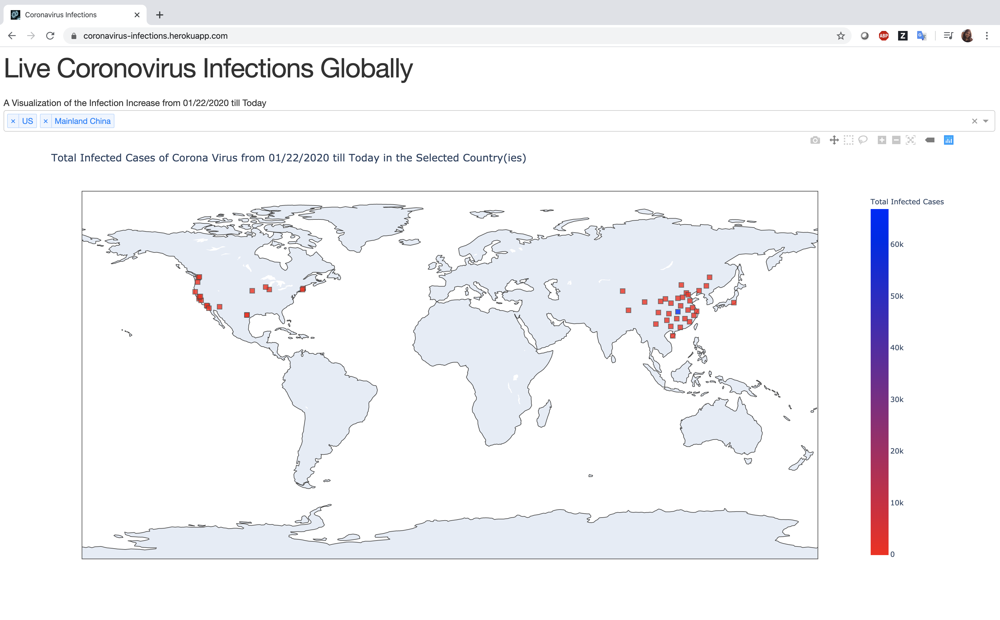
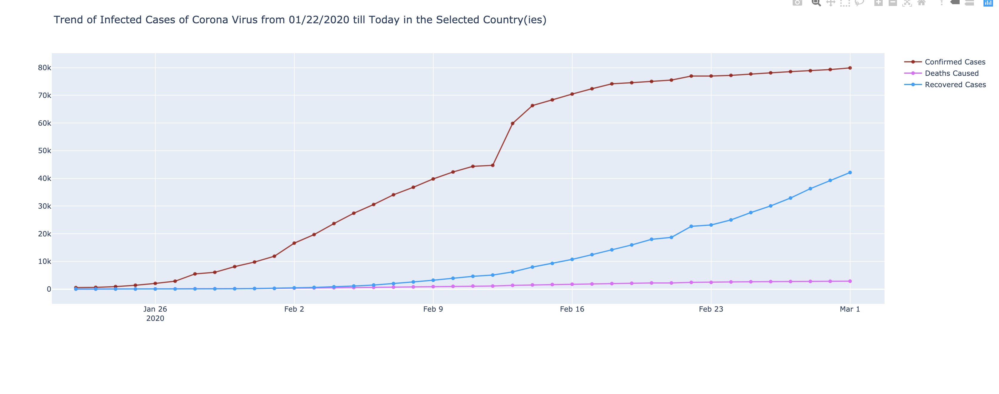
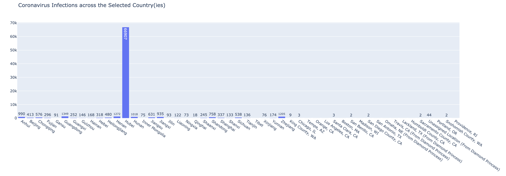
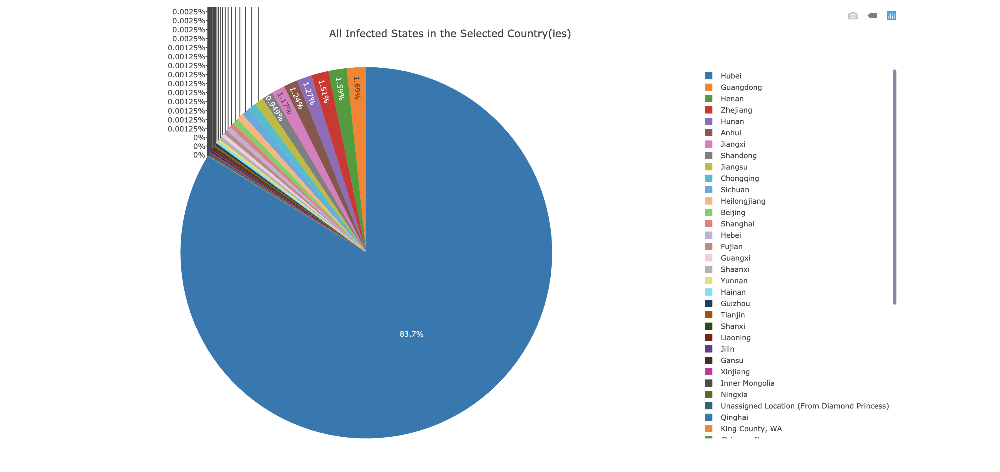
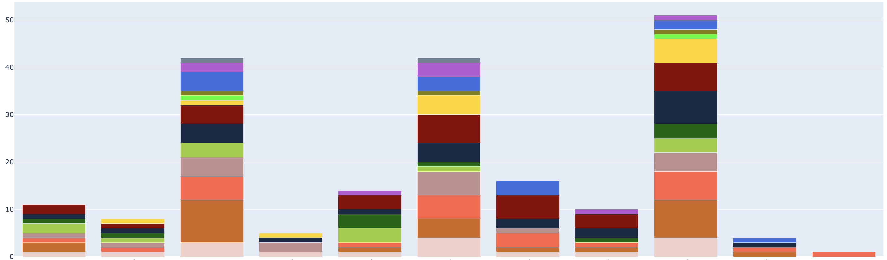

# DIY dashboard for Coronavirus Infections globally using Dash, Plotly and Heroku
### A Live Visualization of the current global state of Coronavirus Infections

Whether you are an enterprise or a small business striving to make an impact on the market, you need to understand the sales, market trend, your revenue drivers and much more. Plotting charts on an excel spreadsheet is old school. A well-organized dashboard is what today’s businesses need to own. The only downside is that all tools available in the market to achieve this quickly has a cost. And, of course, many of us want a free way to achieve this at least initially during the exploratory data analysis phase. I am addressing the same need here and providing a free and quick way to develop a dashboard using plotly, dash and heroku. This demo dashboard would reflect the current affected cases of Coronavirus throughout the world. The data I am using here has been taken from this link and gets updated daily thereby providing us with the latest information on the spread of this infection. You can access this up to date interactive dashboard at https://coronavirus-infections.herokuapp.com/.

Following are the steps/coding required to create this dashboard. You can adapt this code to create any custom dashboard with your own set of data to discover relevant insights.
## Step 1. Create a new folder for your project:
$ mkdir dash_app_example
$ cd dash_app_example
## Step 2. Initialize the folder with git and a virtualenv
$ git init        # initializes an empty git repo
$ virtualenv venv # creates a virtualenv called "venv"
$ source venv/bin/activate # uses the virtualenv
virtualenv creates a fresh Python instance. You will need to reinstall your app's dependencies with this virtualenv:
$ pip install dash
$ pip install plotly
You will also need a new dependency, gunicorn, for deploying the app:
$ pip install gunicorn
## Step 3. Initialize the folder with a sample app (app.py), a .gitignore file, requirements.txt, and a Procfile for deployment
Create the following files in your project folder:
app.py

.gitignore
venv
*.pyc
.DS_Store
.env
Procfile
web: gunicorn app:server
(Note that app refers to the filename app.py. server refers to the variable server inside that file).
requirements.txt
requirements.txt describes your Python dependencies. You can fill this file in automatically with:
$ pip freeze > requirements.txt
## Step 4. Initialize Heroku, add files to Git, and deploy
$ heroku create my-dash-app # change my-dash-app to a unique name
$ git add . # add all files to git
$ git commit -m 'Initial app boilerplate'
$ git push heroku master # deploy code to heroku
$ heroku ps:scale web=1  # run the app with a 1 heroku "dyno" ##not required
You should be able to view your app at https://my-dash-app.herokuapp.com (changing my-dash-app to the name of your app).
## Step 5. Update the code and redeploy
When you modify app.py with your own code, you will need to add the changes to git and push those changes to heroku.
$ git status # view the changes
$ git add .  # add all the changes
$ git commit -m 'a description of the changes'
$ git push heroku master
## Conclusion
I started using dash/heroku while I was waiting for a dashboard software license to be approved. Dashboard is a very neat trick to communicate your data science results within your team as well as with other stakeholders. The downside with dash/heroku is that you have to code each and everything like a traditional web application obviously with the flexibility of a design framework in the background. But, this also adds a lot of control in customizing your content to be delivered. I loved it…I would also like to add some filtering on this website in the coming times for a more organized view and readability on the website.
The outbreak of coronavirus in Hubei has been alarming and has been spreading throughout the globe since then in an unstoppable way. Through this article, I want to create an awareness of the density of infections in the world and for the region you live in. Take care — avoid crowds, keep your hands clean and stop touching your face now and then. If you identify symptoms, be sure to communicate to the right sources immediately. The sooner it can be identified, the better are the chances of survival.
## Bonus
Following are some additional hacks you might find useful while developing your dash/heroku app.
#### 1. List the name of the url associated with your heroku app
heroku info -s | grep web_url | cut -d= -f2
#### 2. List all apps installed in your environment. You can create 5 at the most with the free version of heroku.
heroku apps
#### 3. Delete/destroy an app on Heroku
heroku destroy appname
#### 4. How to give colors if there are more than 10 traces in your stacked/grouped bar chart for example here,
colorway = ['#f3cec9', '#D2691E', '#FF6347', '#BC8F8F', '#9ACD32', '#006400','#182844','#8B0000','#FFD700','#00FF00','#808000','#4169E1','#BA55D3','#708090','#D2B48C','#4682B4','#F5DEB3','#FFE4E1','#DB7093','#DA70D6','#B0E0E6','#00FA9A','#FF7F50','#F08080','#BDB76B']
layout = go.Layout(colorway=colorway)

